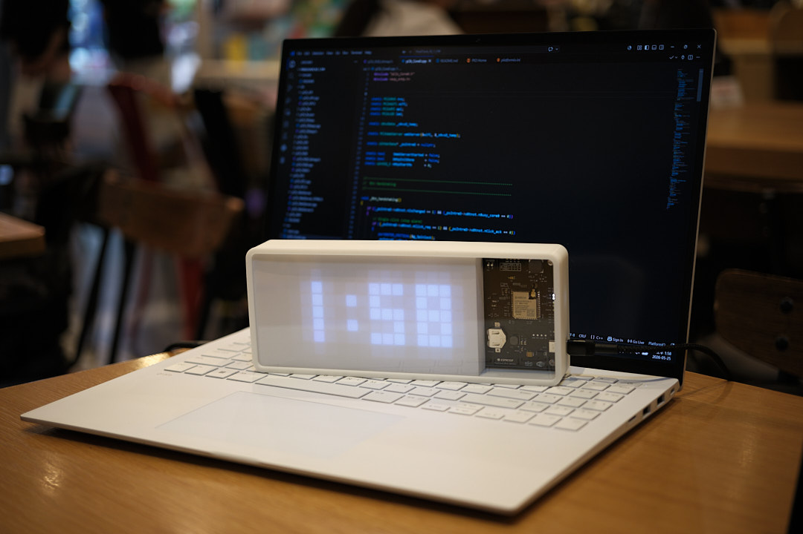
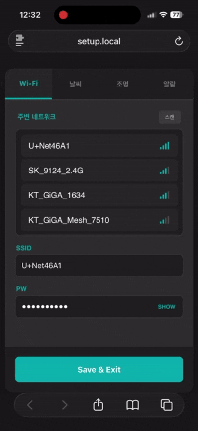

# PixelClock

An ESP32-S3 smart desk clock based on a NeoPixel LED matrix.
A personal project with self-designed PCB, enclosure CAD, and firmware.

---

<p align="center">
  
  
</p>


<!-- Demo GIF -->
<!--  -->

---

## Features

- **Clock** — Automatic NTP time sync, PCF85063A hardware RTC
- **Weather** — KMA ultra-short-term forecast API, displays temperature / sky condition / precipitation
- **Alarm** — Day-of-week repeat alarm with melody and volume control
- **Night Mode** — Auto brightness adjustment via illuminance sensor
- **Sleep Mode** — Auto deep sleep during configured hours, wakes via RTC interrupt
- **Web Setup** — Full configuration through a browser in AP mode

---

## Bill of Materials (BOM)

| Component | Model / Spec |
|-----------|-------------|
| MCU | ESPRESSIF ESP32-S3 WROOM-1U N16R8 |
| NeoPixel Matrix | WS2812B 8×8 module × 2 |
| RTC | PCF85063ATT |
| RTC Backup Battery | CR1220 |
| Buzzer | BMB-2703N |
| Illuminance Sensor | TEMT6000 |
| Regulator | AP63203WU |
| Power Connector | USB Type-C |

---

## Repository Structure

```
PixelClock/
├── CAD/
│   ├── Type_A/                Enclosure Type A design files
│   └── Type_B/                Enclosure Type B design files
├── FW/
│   ├── src/
│   │   ├── main.cpp           Task creation and entry point
│   │   ├── pClk_Core0.cpp     Core0 state machine (WiFi / NTP / API / Web server)
│   │   └── pClk_Core1.cpp     Core1 state machine (Display / RTC / Alarm)
│   ├── lib/
│   │   ├── pClk_API/          KMA weather API
│   │   ├── pClk_Btn/          Button (click / 3s hold / 10s hold)
│   │   ├── pClk_Buzzer/       Buzzer (beep / melody)
│   │   ├── pClk_DSleep/       Deep sleep entry / wake
│   │   ├── pClk_Illu/         Illuminance sensor ADC
│   │   ├── pClk_LED/          Indicator LEDs
│   │   ├── pClk_NVS/          NVS save / load with CRC verification
│   │   ├── pClk_RGB/          NeoPixel rendering (clock / weather / scroll)
│   │   ├── pClk_RTC/          PCF85063A I2C driver
│   │   ├── pClk_WebServer/    AP setup web server
│   │   └── pClk_WiFi/         WiFi AP / STA management
│   └── include/
│       ├── pClk_config.h      GPIO pin map and parameters
│       └── pClk_gData.h       Inter-core shared data structures
└── PCB/
    ├── Gerber/                Gerber files
    └── SMT/                   SMT files
```

---

## Hardware

### PCB

| Item | Spec |
|------|------|
| Size | 63×80mm |
| Layers | 4 |
| Design Files | [PCB/](PCB/) |

### Enclosure

| Type | Size | Design Files |
|------|------|-------------|
| Type A | 217×88×32mm | [CAD/Type_A/](CAD/Type_A/) |
| Type B | 173×88×38mm | [CAD/Type_B/](CAD/Type_B/) |

---

## Software

### Architecture

Runs on FreeRTOS dual-core. Core0 handles networking, Core1 handles display and sensors.

| Core | Role |
|------|------|
| Core 0 | WiFi / NTP / Weather API / Web server |
| Core 1 | NeoPixel matrix / RTC / Illuminance sensor / Button / Buzzer |

---

## Build

**Requirements:** [PlatformIO](https://platformio.org/)

```bash
# Clone the repository
git clone https://github.com/<!-- username -->/PixelClock.git
cd PixelClock/FW

# Build and upload
pio run --target upload

# Serial monitor
pio device monitor --baud 115200
```

---

## Setup

### Weather API Key Required

To use the weather feature, a **KMA Ultra-Short-Term Forecast API** key is required.

- Get a key: [Korea Public Data Portal - KMA Forecast API](https://www.data.go.kr/data/15084084/openapi.do)
- Enter the key in the API Key field on the setup page

### Setup
1. Hold the button for **3 seconds** to enter setup mode (2 beeps)
2. Connect to the **`PixelClock`** Wi-Fi AP
3. Open **`setup.local`** in a browser
4. Configure WiFi, weather API key, alarm, and display settings, then save
5. Device reboots and applies settings automatically

<p align="center">
  
</p>

### Factory Reset

Hold the button for **10 seconds** to clear all NVS settings and re-enter setup mode.

---

## Serial Log

Serial monitor format (115200 baud): `>>> [Module][Function] message`

| Tag | Description |
|-----|-------------|
| `[Core0][BOOT]` | NVS config valid / invalid on boot |
| `[Core0][SETUP]` | Web server started |
| `[Core0][APPLY]` | Config saved, rebooting |
| `[Core0][RESET]` | Factory reset |
| `[WiFi][STA]` | STA connecting / success / failed |
| `[WiFi][AP]` | AP setup complete |
| `[NTP][NTP]` | NTP initialized / received / timeout |
| `[Weather][API]` | Updated / Failed with HTTP code / Parse error |
| `[WEB][HTTP]` | Web server started |
| `[Core1][NVS]` | Settings applied |
| `[Core1][RTC]` | NTP → RTC sync |
| `[Core1][ALARM]` | Alarm fired / auto-stopped |
| `[Core1][ILLU]` | Night mode ON / OFF |
| `[NVS][CRC]` | CRC mismatch (settings cleared) |
| `[RTC][I2C]` | I2C init failed |
| `[DSleep][RTC]` | Entering deep sleep, wake time |

---

## License

[MIT License](LICENSE)

Copyright (c) 2026 <!-- name or GitHub username -->
